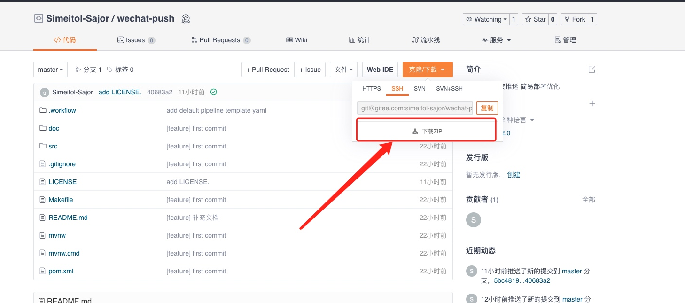

# 微信每日早安推送 简单部署一键启动

本文来自 [小红书大佬七夕节的礼物](http://t.csdn.cn/gzC6Z) 原版大佬的代码，配置有些分散，我将其统一转移到了配置文件中，方便配置。打包部署遇到了些问题，这边修改了一下。也增加了docker启动，简化部署。

后面将介绍如何在**不安装集成开发环境**的情况下，只做一些网站注册，使用docker将程序运行起来。给心仪的人发送爱的消息。


### API申请

我们需要申请一下开发API所需要的key。

[百度天气API](https://lbsyun.baidu.com/apiconsole/center#/home)
[彩虹屁API](https://www.tianapi.com/apiview/181)

以及最重要的[微信测试账号](https://mp.weixin.qq.com/debug/cgi-bin/sandbox?t=sandbox/login)


### 下载源码

大家将代码下载到本地。项目源码：[wechat-push](https://gitee.com/simeitol-sajor/wechat-push)



这个文件路径 `src/main/resources/application.properties`找到配置文件，编辑修改，填入自己刚申请的key。


**定时发送时间**

如果想修改定时时间，可以访问这个定时任务文件路径 `src/main/java/work/sajor/wechatpush/job/JobWorker.java`

```java 
# 七点三十分触发，可以按照自己情况修改
@Scheduled(cron = "0 30 7 * * ?")
```


### 启动

修改好之后，需要安装docker这一个环境即可。大家可以访问这个[网站](http://get.daocloud.io/) http://get.daocloud.io 在自己电脑上安装docker环境。

``` bash
# 构建镜像
docker build . -f Dockerfile --tag sajor:wechat-push

# 启动镜像
docker run --name wechat-push -d -p9999:9999 wechat-push

# 查看运行中容器
docker ps 
```

启动之后，访问本地 `http://127.0.0.1:9999/push` 就可以收到推送了。