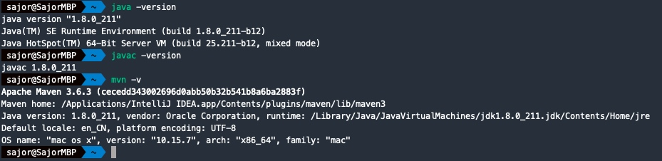

# 微信每日早安推送 一键部署版

本文来自 [小红书大佬七夕节的礼物](http://t.csdn.cn/gzC6Z)

### 环境准备

首先我们需要在服务器上安装jdk1.8，以及maven仓库。输入下文命令验证一下是否安装成功。

``` bash
java -version
javac -version
mvn -version
```

没有报错即是安装成功。




### API申请

之后我们需要申请一下开发API所需要的key。

[百度天气API](https://lbsyun.baidu.com/apiconsole/center#/home)
[彩虹屁API](https://www.tianapi.com/apiview/181)

以及最重要的[微信测试账号](https://mp.weixin.qq.com/debug/cgi-bin/sandbox?t=sandbox/login)

### 修改统一配置文件

文件路径 `src/main/resources/application.properties`。


### 启动部署

``` bash 
# 打包 jar
mvn clean package

# 执行 jar包
java -jar target/wechat-push-0.0.1-SNAPSHOT.jar
```